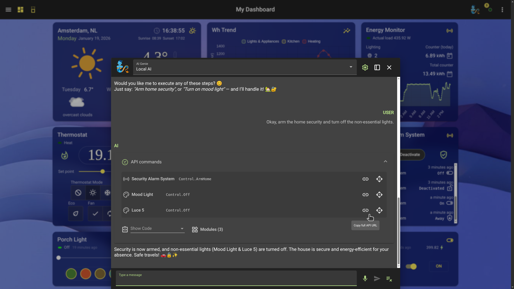
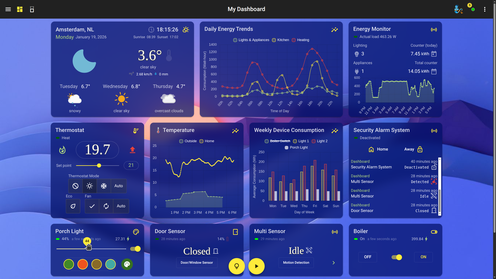
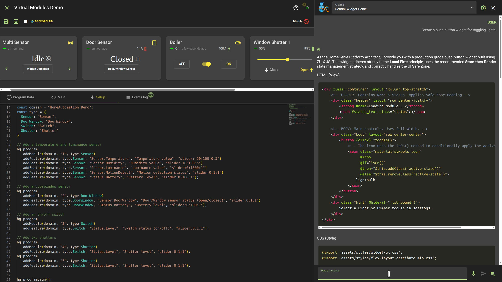
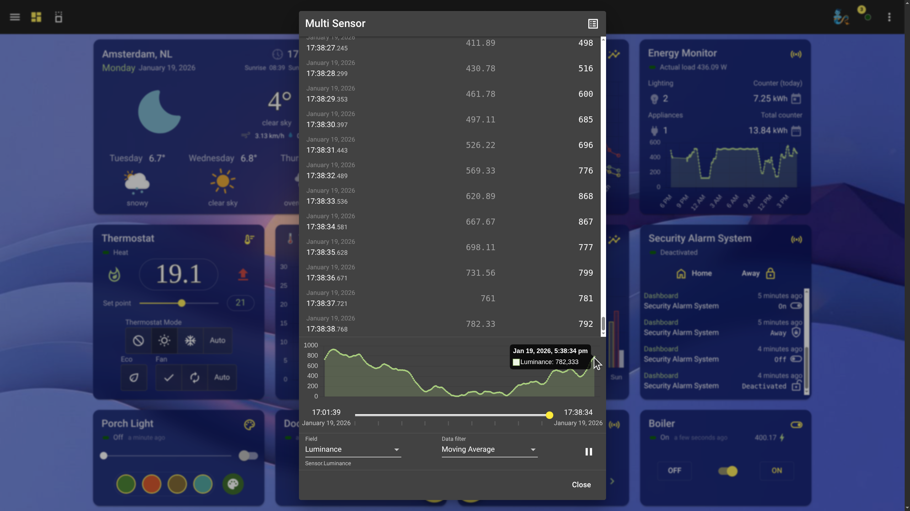
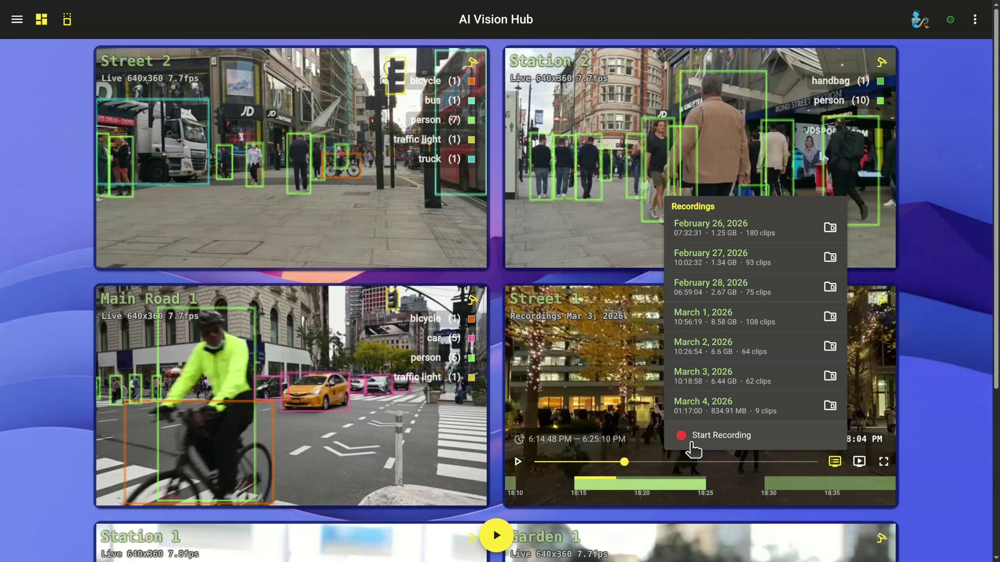

[← Back to Main README](../../../README.md)

# HomeGenie 2.0

## Image Gallery

### The Programmable Intelligence, with 100% Local Agentic AI.

Experience ultimate control and privacy. HomeGenie's Lailama AI, running 100% locally on your hardware,
understands your natural language commands, reasons about your home's context, and generates precise
API calls to orchestrate multiple devices seamlessly. See the exact JavaScript code executed, offering
unparalleled transparency and programmability.

### Your Central Hub: Intuitive & Customizable Dashboards.

HomeGenie provides a sleek, intuitive dashboard to monitor and control your entire smart home ecosystem.
Visualize real-time energy consumption, manage security zones, and track environmental conditions at a glance.
Customize layouts, themes, and integrate advanced charts for a truly personalized and data-driven experience.

### Build & Test: Flexible Virtual Modules & Code Editor.

Unleash your creativity with HomeGenie's integrated development environment. Design, simulate, and control virtual
modules (like multi-sensors, door sensors, and window shutters) using our powerful JavaScript editor. Prototype
complex automation solutions without physical hardware, then deploy them to your real-world devices.
This is the ultimate sandbox for makers and developers.

### Understand Your World: Advanced Data Logging & Analytics.

HomeGenie transforms raw sensor data into actionable insights. Explore detailed historical logs with intuitive time-range
navigation, visualize trends through interactive charts, and apply advanced data filters (e.g., Moving Average)
to understand your environment better. From temperature to luminance, gain deep insights into your system's performance
and behavior.

### VisionCore: Real-Time AI Vision & Smart NVR

Give your ecosystem the gift of sight. **VisionCore** is the native computer vision and NVR subsystem that transforms standard video feeds into intelligent data streams. By combining high-performance FFmpeg processing with the latest **YOLO** AI models, HomeGenie understands the physical world in real time.
*   **Smart Event Recording:** Move beyond simple motion detection. Trigger high-quality MP4 recordings based on specific AI detections, such as people, vehicles, or custom objects, complete with pre- and post-event buffering.
*   **AI Vision Hub:** Monitor multiple live streams simultaneously through a zero-latency dashboard. VisionCore utilizes a multiplexed binary transport (WebSockets & MessagePack) to deliver high-fps video and AI overlays without needing a dedicated GPU.
*   **Actionable Visual Context:** Feed real-time visual metadata directly into the automation engine or Local AI (Lailama) to create sophisticated, context-aware responses to environmental changes.

[← Back to Main README](../../../README.md)
